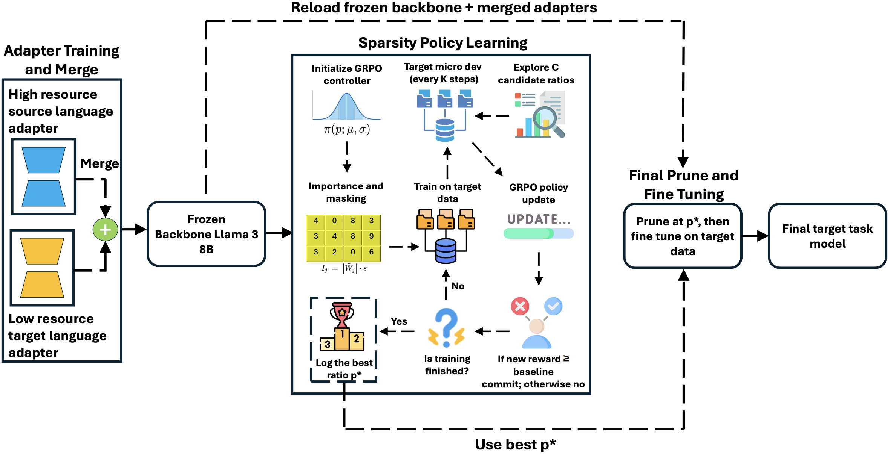

# GRASP LoRA

This folder packages the MLQA and XLsum workflows plus the GRPO controller used to learn sparsity (delete) ratios for bilingual merges (English+Arabic, English+Chinese).

## Abstract
Parameter efficient fine tuning is a way to adapt LLMs to new languages when compute or data are limited, yet adapter pipelines usually choose a global prune ratio by grid search. This practice is computationally expensive and development set intensive, since it repeats training, freezes sparsity, and misses fractional optima. We introduce GRASP LoRA (GRPO Guided Adapter Sparsity Policy), which treats global sparsity as a learnable control variable. A GRPO controller interleaves with training, periodically probing candidate prune ratios on a small micro development set and updating a single global prune ratio online from its reward signal. It operates on merged source and target LoRA adapters on a frozen backbone and replaces grid search with one controller run that learns a prune ratio, followed by a single final merge and prune fine tuning run with pruning fixed to that ratio. On cross lingual transfer from English into Arabic and Chinese, including XL-Sum summarization and MLQA extractive question answering with Llama 3 8B, GRASP LoRA improves semantic faithfulness, content coverage, and answer quality over strong target only and merge and prune baselines. It reduces end to end runtime by multiple times relative to grid search, lowers reliance on large development sets, and makes adapter reuse practical for low resource deployment.

## Prerequisites
- First, generate the datasets and splits: `python dataset/prepare_mlqa_xlsum_splits.py` (requires the `datasets` library and network access). This writes the MLQA and XLsum train/val/test/micro_dev CSVs under `dataset/*/input/` as expected by `dataset_constants.py`.
- Then install the Python dependencies: `pip install -r requirements.txt` (ideally inside your conda environment). If you have 2 GPUs available, set `CUDA_VISIBLE_DEVICES` accordingly and torchrun will shard the work across both instead of a single GPU.
- All scripts automatically set `PYTHONPATH` to use the local `configurations/src` and `dataset` modules.

## MLQA Pipeline
- `merge/1_finetuning_lora_MLQA.sh` — fine-tunes three adapters on MLQA in order: English → Chinese → Arabic. Outputs land in `merge/output/*_adapter`.
- `merge/1_generate_lora_MLQA.sh` — runs inference on the MLQA test split for the Arabic and Chinese adapters; generations go to `merge/output/generations/<lang>`.
- `merge/GRASP_LoRA_ar_ch_MLQA.sh` — GRPO run to learn best delete ratios (sparsity) for English+Arabic and English+Chinese MLQA merges.
- `merge/3_finetuning_merge_del_MLQA.sh` — deterministic sweeps over user-provided delete ratios (`AR_DELETE_PERCENTS` and `CH_DELETE_PERCENTS`) across multiple seeds to reproduce merge+delete variants.
- `merge/3_generate_merge_del_seeds_MLQA.sh` — generates on MLQA using the merge+delete checkpoints produced in the previous step (uses the same ratios and seeds by default).

## XLsum Pipeline
- `merge/1_finetuning_lora_XLsum.sh` — fine-tunes XLsum adapters in order: English summary → Chinese summary → Arabic summary. Outputs land in `merge/output/*_adapter`.
- `merge/1_generate_lora_XLsum.sh` — generates on the XLsum test split for the Arabic and Chinese summary adapters (single adapters, no merges).
- `merge/GRASP_LoRA_ar_ch_XLsum.sh` — GRPO run to learn best delete ratios (sparsity) for English+Arabic and English+Chinese XLsum merges.
- `merge/3_finetuning_merge_del_XLsum.sh` — deterministic sweeps over configurable delete ratios (`AR_DELETE_PERCENTS`, `CH_DELETE_PERCENTS`) across multiple seeds for summary merges.
- `merge/3_generate_merge_del_seeds_XLsum.sh` — generates on XLsum using the merge+delete checkpoints produced in the previous step (same ratios and seeds by default). An alias `merge/3_generate_lora_all_lang_XLsum.sh` points to this generation step.

## Notes
- Default model: `meta-llama/Meta-Llama-3-8B-Instruct`. Override via environment variables in each script if needed.
- Outputs stay under `merge/output` in this repository so you can keep results self-contained when pushing to GitHub.

## Dataset Splits

| Dataset | Lang | Train | Dev | Micro dev | Test |
| --- | --- | ---: | ---: | ---: | ---: |
| XL-Sum | En | 10000 | 1000 | N/A | 1000 |
|  | Ar | 50 | 50 | 16 | 100 |
|  | Zh | 50 | 50 | 16 | 100 |
| MLQA | En | 3030 | 315 | N/A | 315 |
|  | Ar | 50 | 50 | 16 | 100 |
|  | Zh | 50 | 50 | 16 | 100 |

## Main Results

Scores are on a 0–100 scale. Entries of the form `a ± b` report mean `a` and standard deviation `b` across three seeds; we report uncertainty only for the best baseline and best overall method in each block.

| Type | Pruning | BERTScore-F1 | BLEU-4 | ROUGE-L | Pruning | BERTScore-F1 | EM | Token F1 |
| --- | ---: | ---: | ---: | ---: | ---: | ---: | ---: | ---: |
| **XL-Sum (Arabic) / MLQA (Arabic)** |  |  |  |  |  |  |  |  |
| Zero shot (Ar) | — | 69.08 | 2.05 | 10.60 | — | 65.71 | 0.00 | 11.00 |
| LoRA (Ar) | — | 74.33 | 4.46 | 18.17 | — | 84.07 | 29.00 | 43.84 |
| TIES merge (Ar+En) | — | 69.59 | 2.19 | 11.99 | — | 67.19 | 2.00 | 13.28 |
| LoRAHub (Ar+En) | — | 73.76 | 5.10 | 16.85 | — | 83.46 | 29.00 | 42.79 |
| Adaptive LoRA Merge (Ar+En) | — | 74.32 | 4.46 | 18.15 | — | 84.80 | 36.00 | 47.77 |
| Adaptive LoRA Merge + pruning (Ar+En) | 70 | 74.96 ± 0.25 | 6.18 ± 0.29 | 20.19 ± 0.52 | 40 | 85.62 ± 0.09 | 38.33 ± 0.58 | 50.29 ± 0.39 |
| **Ours GRASP LoRA Merge + pruning (Ar+En)** | 67.49 | 75.84 ± 0.13 | 7.93 ± 0.10 | 22.32 ± 0.31 | 48.97 | 86.18 ± 0.27 | 41.00 ± 2.08 | 52.51 ± 0.98 |
| **XL-Sum (Chinese) / MLQA (Chinese)** |  |  |  |  |  |  |  |  |
| Zero shot (Ch) | — | 26.48 | 9.39 | 20.87 | — | 7.12 | 0.00 | 6.95 |
| LoRA (Ch) | — | 31.09 | 13.73 | 28.15 | — | 64.15 | 42.00 | 47.17 |
| TIES merge (Ch+En) | — | 26.23 | 9.37 | 21.30 | — | 11.28 | 0.00 | 13.51 |
| LoRAHub (Ch+En) | — | 26.42 | 10.35 | 24.16 | — | 65.11 | 44.00 | 48.10 |
| Adaptive LoRA Merge (Ch+En) | — | 32.01 | 14.33 | 29.14 | — | 67.45 | 46.00 | 49.63 |
| Adaptive LoRA Merge + pruning (Ch+En) | 50 | 32.00 ± 0.36 | 14.81 ± 0.26 | 29.50 ± 0.41 | 10 | 69.30 ± 1.37 | 46.50 ± 0.71 | 50.93 ± 1.88 |
| **Ours GRASP LoRA Merge + pruning (Ch+En)** | 56.94 | 33.62 ± 0.16 | 16.54 ± 0.15 | 30.95 ± 0.26 | 23.73 | 71.28 ± 0.29 | 48.00 ± 0.58 | 51.60 ± 0.29 |

## Runtime Comparison

| Method | Dataset | # runs | Runtime (min) | Speedup |
| --- | --- | ---: | ---: | ---: |
| **En + Ar** |  |  |  |  |
| Adaptive LoRA (grid search) | XL-Sum | 8 | 242 | 1.00× |
| GRASP LoRA (policy learning + final run) | XL-Sum | 2 | 62 | 3.90× |
| Adaptive LoRA (grid search) | MLQA | 8 | 160 | 1.00× |
| GRASP LoRA (policy learning + final run) | MLQA | 2 | 25 | 6.40× |
| **En + Ch** |  |  |  |  |
| Adaptive LoRA (grid search) | XL-Sum | 8 | 272 | 1.00× |
| GRASP LoRA (policy learning + final run) | XL-Sum | 2 | 48 | 5.66× |
| Adaptive LoRA (grid search) | MLQA | 8 | 164 | 1.00× |
| GRASP LoRA (policy learning + final run) | MLQA | 2 | 22 | 7.45× |

## Attribution and Licensing
- Code in `configurations/src/llama_recipes/` and the wrappers `merge/finetuning.py`, `merge/finetuning_merge.py`, and `merge/finetuning_merge_del.py` is based on Meta's [llama-recipes (now llama-cookbook)](https://github.com/meta-llama/llama-recipes) with modifications and is provided under the [Llama 2 Community License Agreement](https://github.com/facebookresearch/llama/blob/main/LICENSE).
- `merge/merge_models.py` is based on `transformers/models/llama/modeling_llama.py` from Hugging Face Transformers with modifications and is subject to the [Apache License 2.0](https://www.apache.org/licenses/LICENSE-2.0).
- Parts of `merge/lora_allocator.py` are inspired by `adalora.py` from Qingru Zhang's AdaLoRA project (MIT License: https://github.com/QingruZhang/AdaLoRA/blob/main/LICENSE).
- All other code in this repository was newly developed for this research and is released under the MIT License. See `LICENSE` for details.
- Copyright (c) 2026 Besher Mohammad Saleh Hassan (GitHub: https://github.com/besherhasan).
